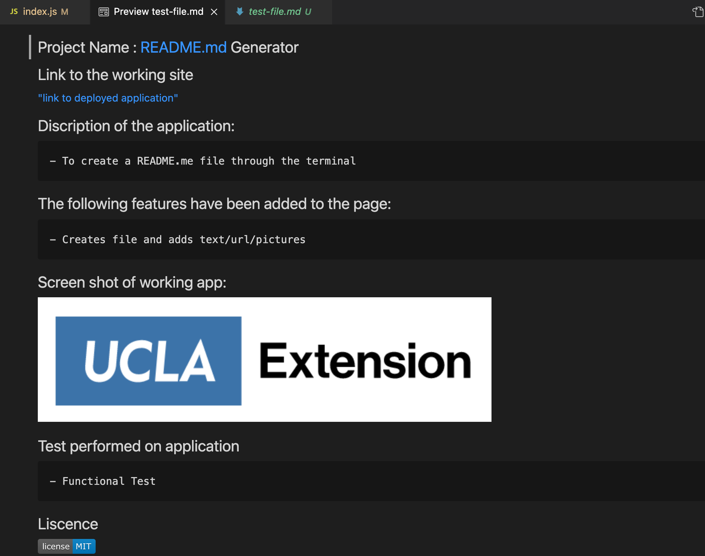

# Project Name : README.md-generator 
 
 

## Link to the working site
 

 ["link to video demonstration"](https://drive.google.com/file/d/1D0lOqiXflUKVzfMiFTuMDtd0mfaKiM9l/view?usp=sharing)

 ["link to Github repo"](https://github.com/Kasdjono/README-generator)
 

## This program will generate a README.md file
 
 

## The following features have been added to the page:
 

        - Asks user to enter the name of the file to be created
        - Asks user to enter the name of the project
        - Asks user to enter the working URL for the application/github
        - Asks user for a description on the project
        - Asks user for the features included in the project
        - Asks user to enter pictures of the application
        - Asks user if any test were perfromed
        - Creates a README.md file that has all of the inputed data in a nice format
        - Included MIT License at bottom of page

 
 

# Screen Shots of Application
 
 

 

